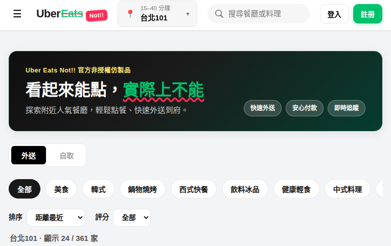
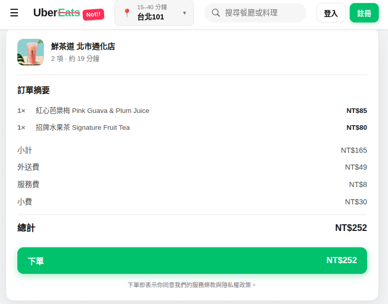
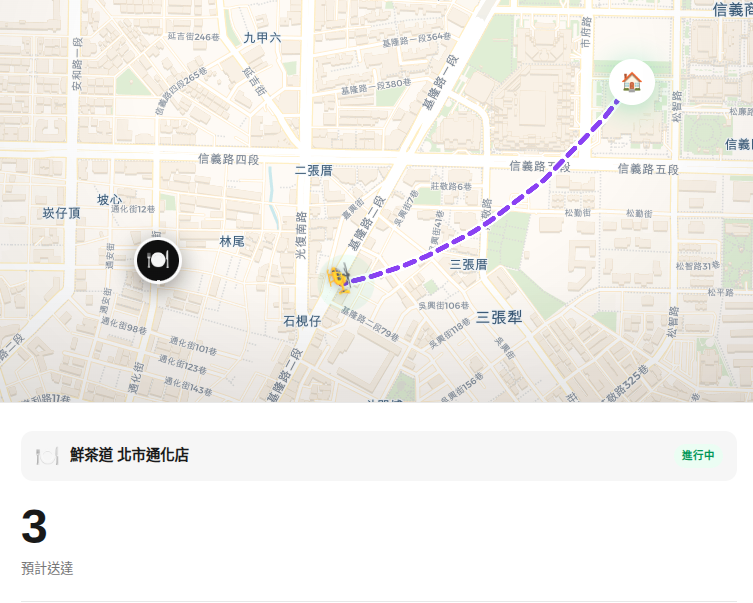
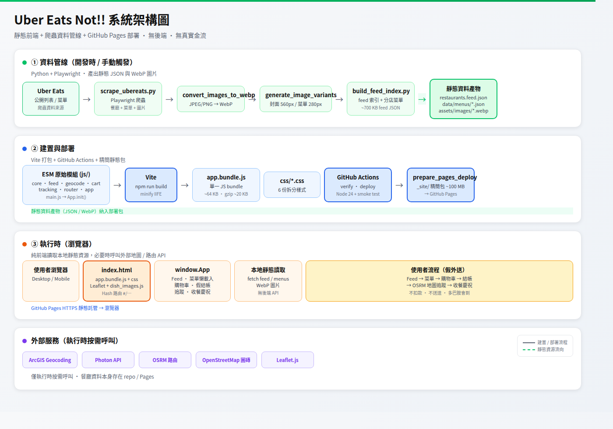

# Uber Eats Not!!：看起來能點，實際上不能


> **一句話版：** 一個高仿 Uber Eats 的靜態惡搞示範站——餐點不會到、錢不會少、多巴胺會到。

- **線上體驗：** [www.bloss0m.com/fake-uber-eats/](http://www.bloss0m.com/fake-uber-eats/)
- **原始碼：** [github.com/poirotw66/fake-uber-eats](https://github.com/poirotw66/fake-uber-eats)

---

## 先說結論：這不是外送 App，是「完整情緒價值」

如果你半夜滑手機、肚子餓、又不想真的花錢點餐——歡迎來 **Uber Eats Not!!**。

它長得像 Uber Eats，操作流程也像 Uber Eats：滑 feed、搜尋餐廳、看菜單、加購物車、假結帳、地圖追蹤外送員，最後還有撒花、震動、五星評分一整套儀式感。

差別只有一個：**什麼都不會真的發生。**

頁面頂部永遠掛著免責橫幅：

> 本產品與 Uber Eats 毫無關係 · 餐點不會到 · 錢不會少 · 多巴胺會到

這就是我想要的產品定位——**All the appetite, none of the delivery.**

---

## 這個專案在做什麼？

**Uber Eats Not!!** 是一個部署在 GitHub Pages 的靜態網站，目標很單純：

1. **視覺與互動**盡量貼近 Uber Eats 台灣版
2. **餐廳與菜單資料**來自真實 Uber Eats 列表（透過 Playwright 爬蟲匯出），不是隨手寫的假資料
3. **完整走過**「選店 → 菜單 → 購物車 → 結帳 → 外送追蹤 → 慶祝收餐」的假流程
4. **零後端、零金流**——純前端 + 靜態 JSON + 圖片

目前 feed 索引共 **361 家餐廳**，菜單與封面圖片存在本地，打開就能瀏覽，不需要即時呼叫 Uber Eats API。

---

## 使用者體驗：從首頁到「假收餐」

### 1. 首頁 Feed：真的像在逛外送平台



*首頁 Hero 橫幅寫著「看起來能點，實際上不能」，下方有外送／自取切換、分類 chips 與排序控制項（截圖：台北 101 區域，顯示 24 / 361 家）。*

首頁提供：

- 餐廳搜尋（店名、分類、地址、菜單品項）
- 排序：距離、評分、送達時間、外送費
- 評分篩選與分類標籤
- 無限捲動載入（增量渲染，不會每次重繪整頁）
- 右側地圖標記附近餐廳（桌面版）

預設地址落在台北 **國泰金融中心／台北 101** 一帶，和當初對齊 Uber Eats TW feed 的區域一致。

---

### 2. 挑店：真實餐廳卡片，點進去才載菜單


*每張卡片顯示送達時間、評分、距離、外送費與「N 品項可點」；部分卡片底部有熱門品項縮圖（截圖：大茗、青山、鶴茶樓、鮮茶道等）。*

點進任一餐廳後：

- 封面與基本資訊（評分、外送時間、外送費）
- 菜單依分類分組，支援品項搜尋
- 菜單 JSON **按需載入**（`data/menus/{id}.json`），首頁只帶輕量 feed 索引
- 品項圖片以 WebP 為主，並有縮圖尺寸優化

---

### 3. 購物車與結帳：儀式感做足，錢包很安全



*以「鮮茶道 北市通化店」為例：2 項飲料、小計 NT$165，加上外送費／服務費／小費後總計 NT$252（不會真的扣款）。*

你可以：

- 調整數量、累計金額
- 選小費（0%～20%）
- 點選 Visa / Apple Pay 等付款方式（純 UI）
- 送出訂單——**不會真的扣款**

若沒設定 GPS 定位，系統會提醒你開定位，因為後面的追蹤地圖需要一個「你家」的座標。

---

### 4. 外送追蹤：OSRM 路線 + 16 種交通工具



*手機版追蹤畫面：地圖上顯示店家、外送員與目的地，紫色虛線為路線；底部顯示「鮮茶道 北市通化店」進行中，預計 3 分鐘送達。*

這段是我個人最愛的部分。

外送員會沿著 **OSRM** 算出的真實道路路線移動，時間軸依序顯示：訂單確認 → 店家準備 → 取餐 → 外送中 → 抵達。

交通工具不只機車，還有整份惡搞清單：

| 正常派 | 神秘派 |
|--------|--------|
| 🛵 機車、🚗 汽車、🚲 腳踏車 | 🚁 直升機、🛸 UFO、🚀 火箭 |
| 🚶 步行、🐴 馬匹、🛼 溜冰鞋 | 🫧 潛水艇、🕊️ 信鴿、✨ 瞬移 |

選「潛水艇」時，外送員會走地底直穿路線；選「熱氣球」則隨風飄移——路線算法會依載具切換 **道路 / 飛行 / 漂移 / 拋物線 / 瞬移** 等不同移動模式。

---

### 5. 收餐慶祝：情緒價值拉滿


*全螢幕「餐點已送達！」慶祝頁：外送員林冠廷駕駛 🚁 直升機「空中直飛」完美送達，下方列出紅心芭樂梅等訂單品項。*

外送員抵達後，按下「與外送員碰面」：

- 全螢幕慶祝動畫（紙花、emoji 雨、閃光）
- 手機震動回饋（支援的裝置上）
- 訂單明細與假付款金額
- 五星評分——你可以給外送員五顆星，雖然他什麼都沒真的送來

然後點「開動吧！」回到首頁，再點一輪。

---

## 技術架構一覽



*四層架構：① Python 爬蟲資料管線 → ② Vite 打包與 GitHub Pages 部署 → ③ 瀏覽器純前端執行 → ④ 外部 geocoding / OSRM / 地圖服務。*

### 前端：零框架、模組化、單檔部署

| 層級 | 說明 |
|------|------|
| **執行環境** | 純 HTML / CSS / JavaScript，無 React / Vue |
| **模組** | ESM 拆分：`core`、`feed`、`geocode`、`cart`、`tracking`、`router`、`app` |
| **打包** | Vite 產出單一 `app.bundle.js`（約 64 KB，gzip ~20 KB） |
| **地圖** | Leaflet + OpenStreetMap 圖磚 |
| **路由** | Hash routing（`#/restaurant/{id}` 等） |
| **樣式** | 拆成 `base` / `home` / `restaurant` / `checkout` / `tracking` / `responsive` 六份 CSS |

`index.html` 最終只載入 **一個** JavaScript bundle（外加 Leaflet 與 `dish_images.js`），從早期七支 script 精簡而來。

### 資料管線：爬一次，到處用

```text
Playwright 爬蟲 (scrape_ubereats.py)
    ↓
圖片轉 WebP (convert_images_to_webp.py)
    ↓
產生縮圖變體 (generate_image_variants.py)  — 封面 560px、菜單 280px
    ↓
建立 feed 索引 (build_feed_index.py)      — restaurants.feed.json + data/menus/*.json
    ↓
靜態站讀取本地 JSON / WebP
```

前端**不會**在瀏覽器裡即時爬 Uber Eats；所有資料都是預先匯出的靜態檔，適合 GitHub Pages 這種純靜態託管。

### 效能與部署優化

為了讓 GitHub Pages 也能跑得動，做了幾件事：

| 優化項目 | 效果 |
|----------|------|
| WebP 圖片 + 縮圖變體 | 圖片體積從約 300 MB 壓到約 86 MB |
| 精簡 `restaurants.feed.json` | feed 索引約 700 KB，搜尋改查菜單檔 |
| 菜單懶載入 + 記憶體快取 | 首屏只載入必要資料 |
| Feed 增量渲染 | 捲動載入時 append 卡片，避免整頁重繪 |
| `_site/` 部署包 | 排除原始 JPEG、開發用 JSON、ESM 原始碼，部署包約 100 MB |

CI 流程（GitHub Actions）：

1. `npm ci` → `npm run build` → smoke test
2. `prepare_pages_deploy.sh` 組裝 `_site/`
3. 推上 `main` 自動發布到 GitHub Pages

---

## 給開發者的快速上手

```bash
git clone https://github.com/poirotw66/fake-uber-eats.git
cd fake-uber-eats
npm ci
npm run build
python -m http.server 8080
# 開啟 http://localhost:8080
```

若要更新餐廳資料（需 Python 3 + Playwright + `.env`）：

```bash
pip install -r scripts/requirements.txt
playwright install chromium
./scripts/run_scrape.sh
```

---

## 為什麼做這個專案？

老實說，動機很混雜：

1. **技術練習**——爬蟲、靜態站效能、地圖路線動畫、模組化前端，一次練到
2. **惡搞與諷刺**——外送平台把「點餐衝動」封裝得太完美，那就做一個「只有衝動、沒有代價」的版本
3. **作品集展示**——看起來像產品，其實是精心拼裝的 demo；看起來像惡搞，其實工程上很認真

它回答了一個荒謬但真實的問題：

> 如果把所有外送 App 的 UX 都保留，只拿掉「真的會送達」這件事，使用者還會覺得滿足嗎？

至少對我來說——**會。** 而且還省了一頓宵夜錢。

---

## 免責聲明

- 本專案與 **Uber Eats 及 Uber 無任何關聯**，純屬 parody / 教育與娛樂用途
- 餐廳名稱、菜單、圖片可能來自公開列表之爬蟲匯出，**請勿用於商業訂餐、冒充官方或任何違反服務條款之行為**
- 不涉及真實付款、真實外送、使用者帳號系統

---

## 結語

**Uber Eats Not!!** 是我對「現代外送 UX」的一次拆解與重組：

- 資料是真的（來自真實列表）
- 體驗是真的（搜尋、購物車、追蹤、慶祝）
- 結果是假的（沒有食物、沒有扣款）

如果你也想在深夜體驗「點餐快感」而不付帳單，歡迎試玩：

👉 **[線上 Demo](http://www.bloss0m.com/fake-uber-eats/)**  
👉 **[GitHub 原始碼](https://github.com/poirotw66/fake-uber-eats)**
